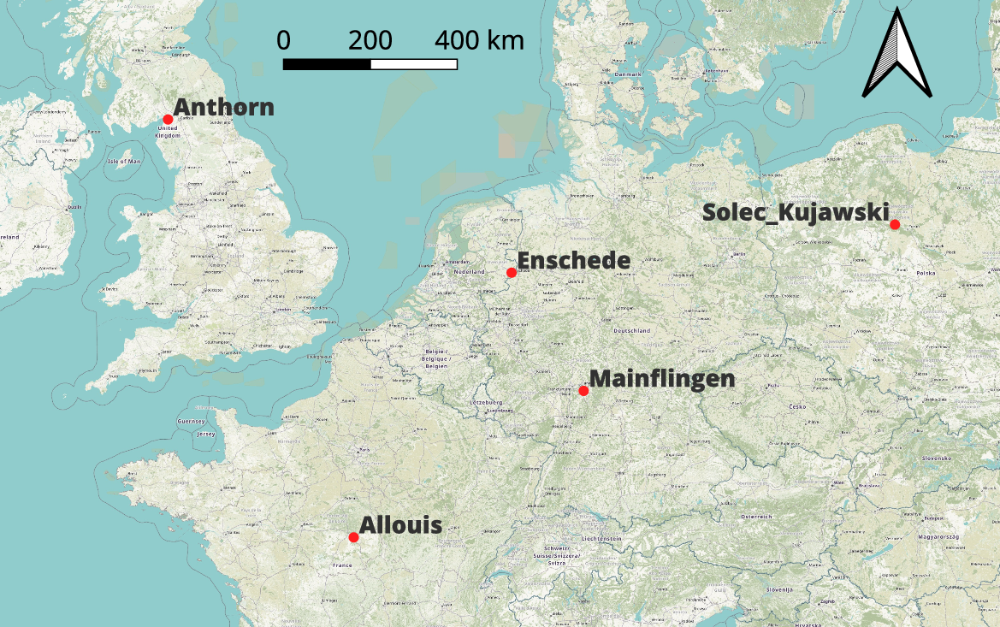
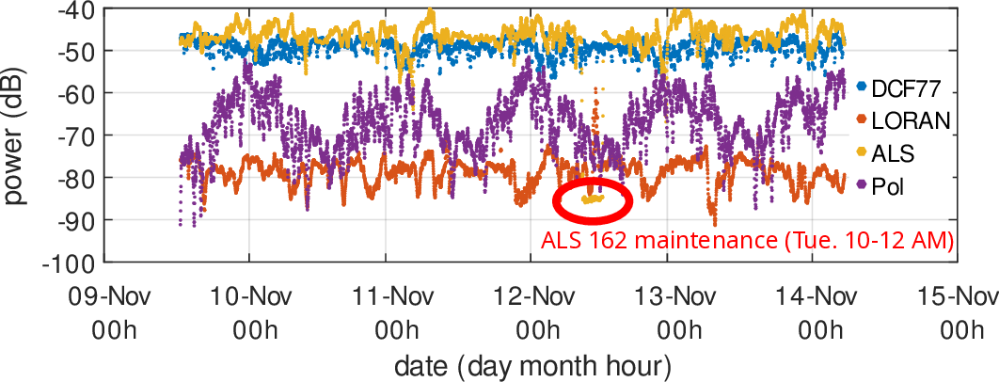

# Probing WebSDR in Twente for time transfer signal power

Based on https://github.com/mgiugliano/WebSDRcat for recording the
signal power from DXF77 (Germany), LORAN (UK), ALS162 (France)
and eCZAS (Poland) from Enschede in the Nederlands.

Uses ``selenium`` for automating the interrogation of the web site
and read the S-meter value for each frequency.

Resulting chart:

