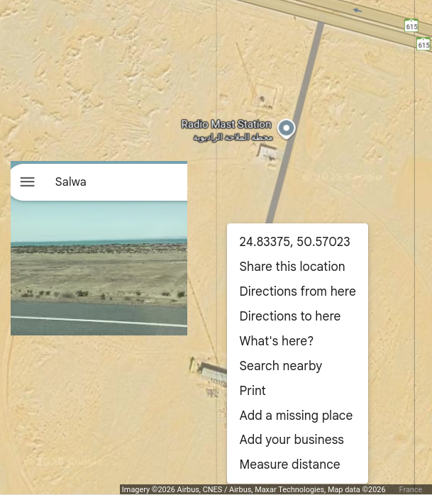

# Saudi Arabia chain

GRI is 8830, but only secondary emissions are received from the Qatar 
KiwiSDR station located at 25.2854N, 51.5310E, none from Riyad or Kuwait.

Result of ``crc_eloran.m`` following the execution of ``process_eloran.m`` (after removing the false positive starting at position 476):
```
0057 data 10000010101111010000001111001111010111110000000010001001 CRC 10011100001000 RS 01001011011000100000010100101000000000100001101101000010011001010100111011001110111111101011110111111000100010110010000101101001111111110000
0057 data  41 2F 20 3C 7A 7C 01 09 CRC  4E 08 RS  25 58 40 52 40 08 36 42 32 53 59 6F 75 77 71 0B 10 5A 3F 70
0057 flip  08 39 48 40 1F 2F 1E 02 7A 41      RS  07 7E 2D 04 68 47 77 57 7B 4D 65 26 21 36 08 01 25 01 0D 52
0267 data 00100001111100000100100101101011001001100010010001111000 CRC 10010100001111 RS 00101101010101111111011001000000010001000000100011011111110101000000111111001001100110000011110011000010110101010110100001110001011101111000
0267 data  10 7C 09 16 59 18 48 78 CRC  4A 0F RS  16 55 7E 64 02 10 11 5F 6A 03 79 19 41 73 05 55 34 1C 2E 78
0267 flip  78 29 0F 09 0C 4D 34 48 1F 04      RS  0F 3A 1C 16 55 50 67 41 4C 4F 60 2B 7D 44 04 20 13 3F 55 34
0477 data 01101000110100101110001001001101010011001000110101001100 CRC 10001001011110 RS 01100010001111011100010100001111111000010000001000101111110010011000101000011100001001011010010000111100100100110000100001111000001010010111
0477 data  34 34 5C 24 6A 32 1A 4C CRC  44 5E RS  31 0F 38 50 7F 04 04 2F 64 62 43 42 2D 10 79 13 04 1E 05 17
0477 flip  3D 11 19 2C 26 2B 12 1D 16 16      RS  74 50 3C 10 64 4F 04 5A 21 61 23 13 7A 10 10 7F 05 0E 78 46
```
with the RS FEC validated when including ``rs30_10_decode.oct`` in this directory:
```
0267  78 29 0F 09 0C 4D 34 48 1F 04 RS  0F 3A 1C 16 55 50 67 41 4C 4F 60 2B 7D 44 04 20 13 3F 55 34
0477  3D 11 19 2C 26 2B 12 1D 16 16 RS  74 50 3C 10 64 4F 04 5A 21 61 23 13 7A 10 10 7F 05 0E 78 46
```

The binary sentences are decoded as follows:

```
10000010101111010000001111001111010111110000000010001001
```
as message 1 as documented in ITU-R M.589-3:
* ``bin2dec(fliplr("0010101111010"))=3028`` modified Z count
* ``0``: scale
* ``00``: User Differential Range Error (UDRE)
* ``bin2dec(fliplr("00111"))=28`` satellite PRN
* ``bin2dec(fliplr("100111101011111"))=32121`` Pseudo-Range Correction (PRN)
* ``bin2dec(fliplr("00000000"))=0`` Range Rate Correction (RRC)
* ``bin2dec(fliplr("10001001"))=145`` Issue of data (IOD)

```
00100001111100000100100101101011001001100010010001111000
```
as message 4 Eurofix Station ID/Health message
* ``bin2dec(fliplr("0001111100"))=248`` station ID
* ``000``: health (000 is UDRE Scale Factor=1)
* ``10``: eLORAN
* ``010``: Whiskey Secondary
* ``01``: Longitude
* ``bin2dec(fliplr("01101011001001100010010001111000"))*1e-7``: 50.5701590 deg E
matching the Salwa transmitter longitude



```
01101000110100101110001001001101010011001000110101001100
```
as message 6
* ``10`` is flipped to 01 as subtype 1
* ``bin2dec(fliplr("00110100101110001001001101010"))*1e-5=1809.5`` in tens of microseconds within the hour (30 min, 9.5 seconds)
* ``bin2dec(fliplr("01100100011010"))=5670`` for Aug 25 at 6 AM
* ``bin2dec(fliplr("100110"))=25`` for 2025
* ``0``: spare

These information are in agreement with the filename ``20250825T063002Z_100000_QTR_iq.wav`` indicating that the record was collected on Aug 25, 2025 at 6:30 UTC.
