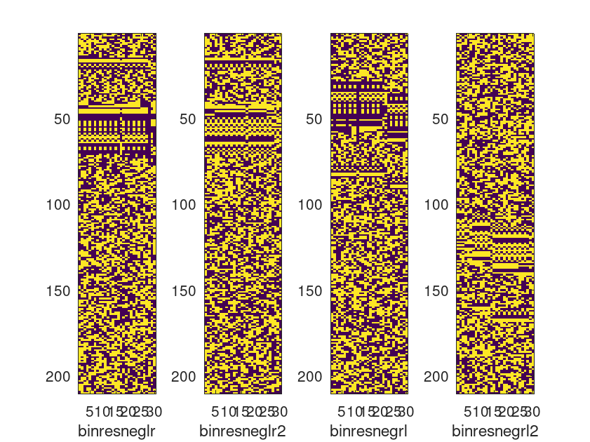
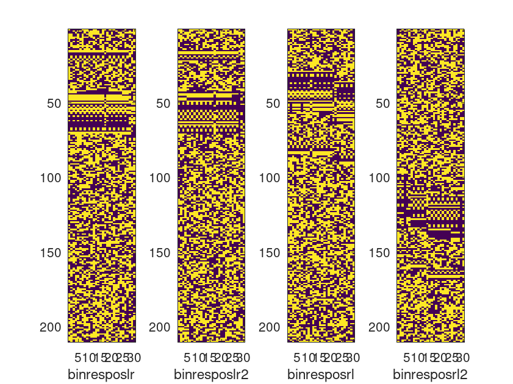
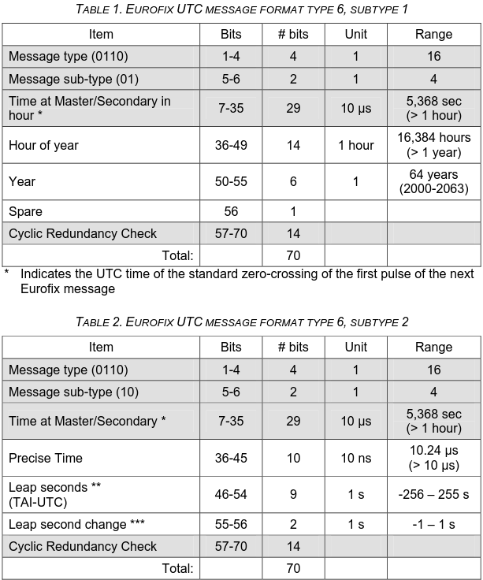

# eLORAN digital payload decoding

## Recoring: ``command.sh``

A 15-min long record was collected from the KiwiSDR station G0GHK 
whose coordinates are documented in <a href="G0GHK.txt">G0GHK.txt</a>,
close enough to Anthorn to provide excellent SNR. The record
is 20251014T122009Z_100000_G0GHK_iq.wav.

## Pulse detection: ``process_eloran.m``

The pulses are alternating Master and Secondary. We observe that all Master
pulses exhibit 0 or 90 degree phases, i.e. no +/- 1 us shift indicating 
digital payload content. Only secondary pulses include +/-36 degrees phase
shift since +/-1 us at 100 kHz carrier is +/- 36 degrees phase shift.
Attributing +/- 36 phase shift to +/-1 bit state leads to two possible
schemes, and accumulating the bits left to right or right to left to
another 2, hence 4 resulting files.

## Preliminary analysis: bit organization ``crc_eloran.m``

Some reasonable pattern appears when mapping bit states 
reorganized as matrices with 210 elements (sentence length 
including payload, CRC and FEC):




Each message is 210 bit long, each GRI (67.31 ms for Anthorn) broadcasts 
7 bits so the duration between each sentence is $67.31*(210/7)=2.02$ s

## CRC detection: ``crc_eloran.m``

As known from RDS analysis, a continuous stream of bit requires 
synchronization, and sliding CRC calculation untile a match
is detected is one way of detecting the beginning of sentences
in the absence of a synchronization word. Again many degrees of
freedom in swapping the polynomial coefficients, bit order or
remainder order.

At the end, many more matches than expected are provided with
``crc_eloran.m``, but few enough are 210 bits apart. The
result is the file <a href="crc_eloran.txt">crc_eloran.txt</a>
where sentences not 210 bits from their neigbours have been 
deleted.

## Payload analysis

According to <a href="https://www.reelektronika.nl/manuals/reelektronika_Differential_eLoran_Manual_v1.0.pdf">the reelektronika manual</a> on page 46, the sentence 
0110 is LORAN UTC message, whos <a href="https://www.reelektronika.nl/manuals/reelektronika_LORADD_UTC_Manual_v1.21.pdf">format is described in this manual</a> and reproduced below:

```
01100100111000100110111111110011100000000000011011000000
01101001100111101101110100001011100001110110101101001100
01100100001101010000000110001011100000000000011011000000
01101001011110111010001001001011100001110110101101001100
``` 

is analyzed as
* 0110: LORAN UTC (must be 0110)
* 01: message subtype (must be 01 or 10)
* 00111000100110111111110011100: time at master/secondary in hours (in 10 us
  unit): ``bin2dec(fliplr("00001101010000000110001011100"))*1e-5`` 
  indicates 1216.2486 and then 1220.2872, consistent with 2 seconds/message and 
  with minutes around 20 in the hour (see .wav filename)
* 00000000001101: hour of year (13): ``bin2dec(fliplr("00000000001101"))`` indicates
  11264 hours ???
* 100000: year 1 ???
* 0: spare

or for message subtype 2:
* 0110: LORAN UTC
* 10: message subtype
* 01100111101101110100001011100: time at master/secondary in hours (in 10 us
  unit): ``bin2dec(fliplr("01100111101101110100001011100"))*1e-5=1218.2679``
  consistent with the previous value
* 0011101101: precise time in 10 ns units (``bin2dec(fliplr("0011101101"))*0.01=7.32`` us)
* 011010011: leap seconds (-54) (should be 37 ???)
* 00: leap second change


