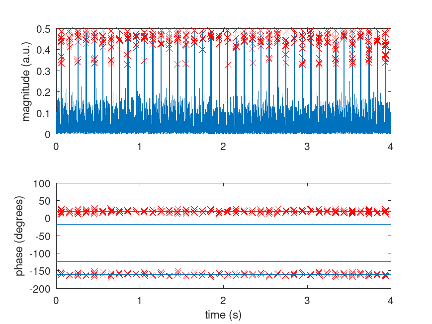

# Korean chain

Running ``process_eloran.m`` only detects alternating A and B master messages so no Secondary signal
that would carry eLORAN digital payload
```
+master   A: 
+master   B: 
+master   A: 
+master   B: 
+master   A: 
+master   B: 
...
```

as readily seen on the phase of the pulses which only exhibit +/-90 degree values and no +/-1 us shift
that would indicate digital payload.


