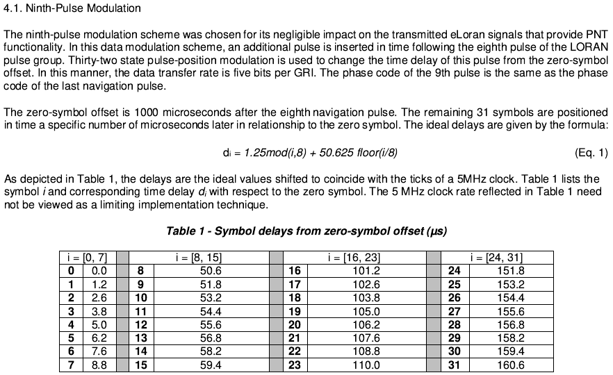
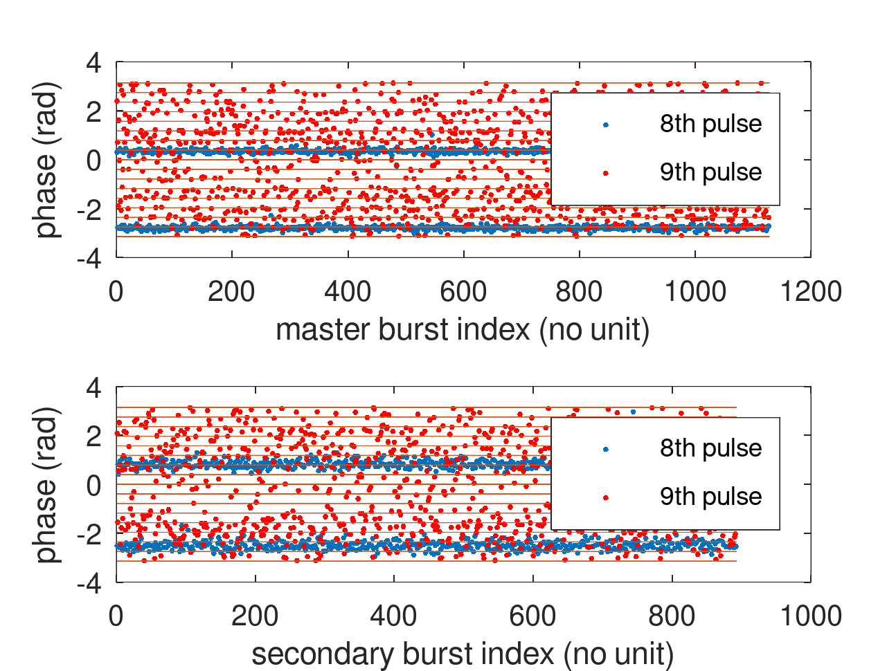
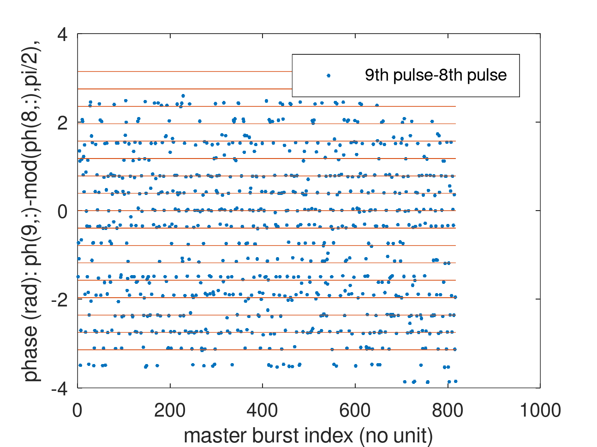
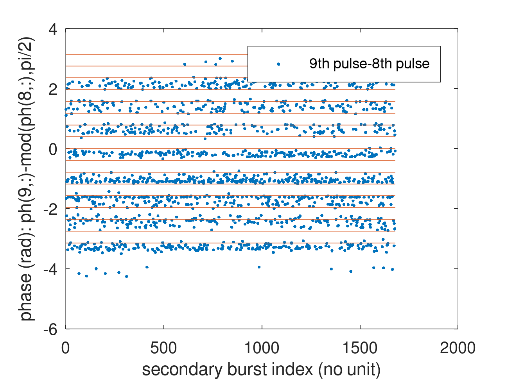

# 9th pulse position coding

According to SAE9990/2 (see below), the 9th pulse starts 1000 us after the 8th
pulse and is positioned 0 to 160 us to encode the 32 possible bit values.

When sampling at 12 kHz, 1 ms lasts 12 samples, so the 9th pulse position starts
12 samples after the 8th.

When sampling at 12 kHz, the sampling period is 83.33 us so that two delay values
are included in each subsequent sample, bit values 0 to 15 (delays 0 to 60 us) in
sample 13, and delay 100 us to 160 us in sample 14. The delay $\tau$ is detected
as a phase $\varphi$ through $\varphi=2\pi\cdot f\cdot\tau$ with $f$ the carrier
frequency 100 kHz.

Hence, each delay increment of 1.25 us is a phase increment of 45 degrees, and
the 0 to 7 bit values span 0 to 315 degrees. The second bit sequence separated by 
50.525 us starts at mod(50.625,10)=0.625 us which is a phase of 22.5 degrees and
the second set of bit values from 8 to 15 are detected as phase values separated
by 45 degrees but interleaved with the first set.

Finally, 101.25 on sample 14 is detected again as 45 degrees and same for the
last bit sequence.

The challenge in phase identification is that now the phases are only separated
by 22.5 degrees instead of the 36 degrees of the Eurofix.

The <a href="plot_9pulse_histo.m">plot_9pulse_histo.m</a> script simulates the 
expected phase distribution as a function of bit value.

## Real signal analysis

The KiwiSDRs located at 35.6N, 117.8W (21214.proxy.kiwisdr.com) and 38.18N, 121.79W (22085.proxy.kiwisdr.com)
were used to record signals from the USA west coast chain.

https://www.ion.org/itm/abstracts.cfm?paperID=15124 states that 2 of the 3 USA west-coast
stations are broadcasting the Loran Data Channel (LDC).

https://www.ursanav.com/wp-content/uploads/UrsaNav-ILA-40-eLoran-Signal-Specification-Tutorial.pdf
states that "The 9th Master pulse in the 10th pulse slot is no longer needed for identification 
and can be removed. This improves cross-rate interference and frees up the slot for the LDC." so
that the 9th pulse polarity is now considered as carrying data.

However, as can be seen on

identifying pulse positions only separated by 22.5 degrees is very difficult with the
available signal to noise ratio. No obvious pattern allowing to identify a 9th pulse
position information on either master or secondary station is visible, despite the
phase being uniformly distributed between 0 and 360 degrees (the magnitude of the pulse
was verified to assess that this is not noise).

At least this KiwiSDR station seems to have a nicely GNSS-disciplined oscillator since hardly
any phase drift can be seen.

From another KiwiSDR station close to Seattle and its George (W. state) emitter the result
is easier to analyze:

and so is the analysis of the recording from Utah

concluding with probably the Nevada station (Fallon) not broadcasting a 9th pulse digital message.
