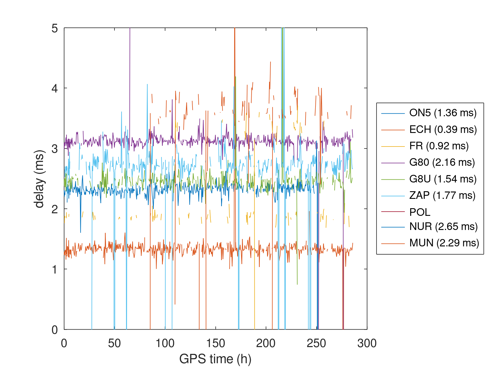

# Processing KiwiSDR datasets for assessing time and frequency transfer

## Compiling

In ``kiwiclient/``: edit ``read_kiwi_iq_wav.cc`` and comment lines 104 and 105,
then
```
mkoctfile read_kiwi_iq_wav.cc
```

## Installing

The ``crontab`` should be tuned to call the recording script at the right 
location, possibly also at better time.

## Results

Three GNU/Octave scripts are used to process the DCF77 (77.5 kHz from 
Mainflingen, Germany), ALS162 (162 kHz from Allouis, France) and LORAN 
(100 kHz from Saudi-Arabia, recorded from Qatar).

### ALS162

Expected time of flight differences are estimated from the GPS positions
of the emitters and receivers (see ``positions.txt``), assuming a speed 
of light of 300 m/us:


ALS162 only provides a 0-crossing transition from +1 rad to -1 rad over 50 ms
to identify the beginning of the second:




### DCF77

Using the 512-chip long pseudo-random sequence phase modulation to improve the
signal to noise ratio, spread the spectrum to achieve fine time of flight 
measurement despite the low sampling rate of 12 kHz.


### LORAN-C

LORAN C uses a Group Repetition Interval (GRI) in 10 us unit leading to a non-integer
copies of the code each second. For aligning, either decode the Z-counter to identify
the code index within the sequence and hence the time offset, or here rely on the
GPS timestamp to obtain a coarse time estimate from which the pulse position is deduced,
knowing the GRI. Only th 8-pulses of the Master are considered, and averaged of 10 successive
copies


