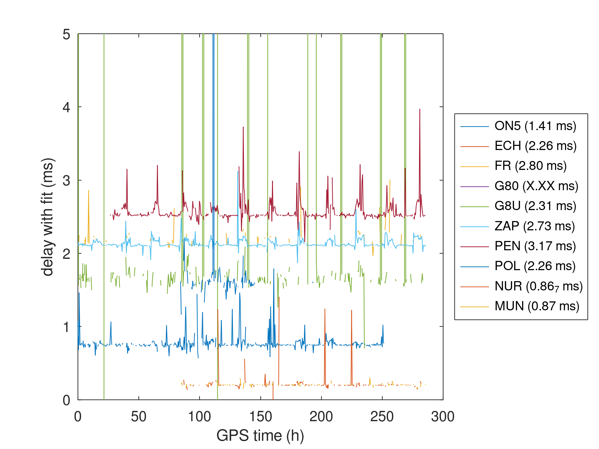
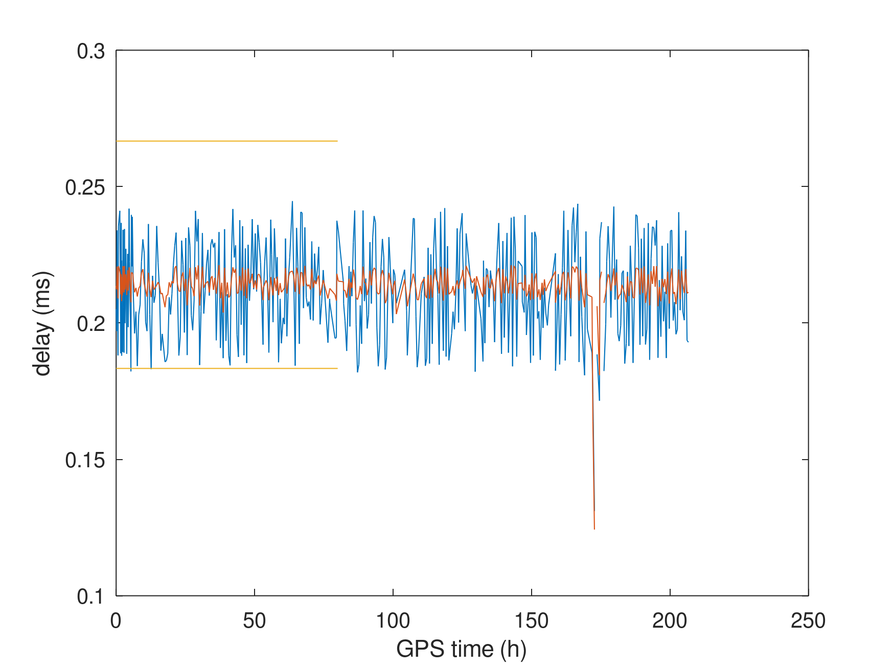
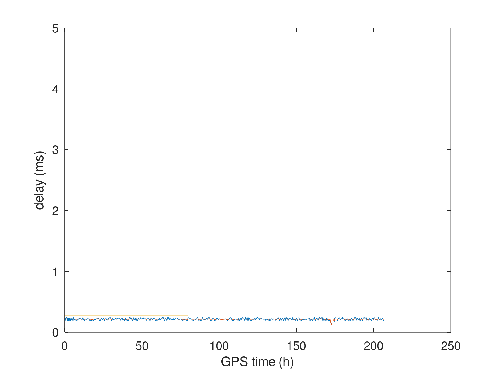
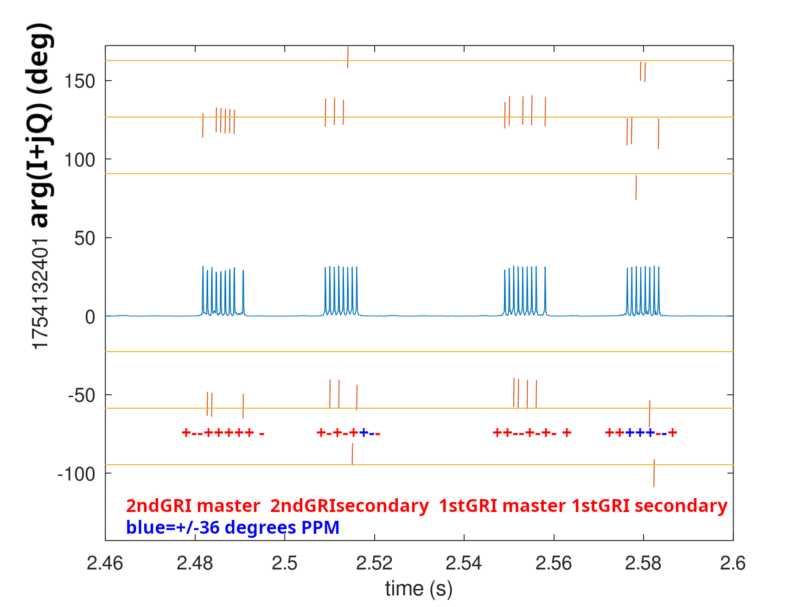

# Processing <a href="http://kiwisdr.com/.public/">KiwiSDR</a> datasets for assessing time and frequency transfer

Recording GPS-timestamped KiwiSDR datasets from ALS162 (162 kHz), LORAN (100 kHz) and
DCF77 (77.5 kHz) for assessing the impact of ionosphere and space weather disturbances
on time and frequency transfer.

## Compiling

In ``kiwiclient/``: edit ``read_kiwi_iq_wav.cc`` and comment lines 104 and 105,
then

```
mkoctfile read_kiwi_iq_wav.cc
```
to compile the GNU/Octave binary library for reading the record contents.

## Installing

The ``crontab`` should be tuned to call the recording script at the right 
location, possibly also at better times: at the moment, set to every full and
half hours.

## Results

Three GNU/Octave scripts are used to process the DCF77 (77.5 kHz from 
Mainflingen, Germany), ALS162 (162 kHz from Allouis, France) and LORAN 
(100 kHz from Saudi-Arabia, recorded from Qatar). The first two scripts
are mostly location independent, the LORAN-C dataset assumes GRI 8830
(meaning the code repeats every 88.3 ms)

### ALS162

Expected time of flight differences are estimated from the GPS positions
of the emitters and receivers (see ``positions.txt``), assuming a speed 
of light of 300 m/us (which is incorrect, see ASF correction for LORAN-C
when the surface wave travels slower over ground):


<a href="https://en.wikipedia.org/wiki/ALS162_time_signal">ALS162</a>
only provides a 0-crossing transition from +1 rad to -1 rad over 50 ms
to identify the beginning of the second:


### DCF77

Using the <a href="https://www.eecis.udel.edu/~mills/ntp/dcf77.html">512-chip long</a> 
pseudo-random sequence phase modulation [1] to improve the signal to noise ratio by spreading 
the spectrum to achieve fine time of flight measurement despite the low sampling rate of 
12 kHz.



[1] <a href="https://www.ptb.de/cms/fileadmin/internet/fachabteilungen/abteilung_4/4.4_zeit_und_frequenz/pdf/5_1988_Hetzel_-_Proc_EFTF_88.pdf">P.Hetzel, Time dissemination via the LF transmitter DCF77 using a pseudo-random phase-shift 
keying on the carrier, Proc. 2nd EFTF (1988)</a>

### LORAN-C

LORAN C uses a Group Repetition Interval (GRI) in 10 us unit leading to a non-integer
copies of the code each second. For aligning, either decode the Z-counter to identify
the code index within the sequence and hence the time offset, or here rely on the
GPS timestamp to obtain a coarse time estimate from which the pulse position is deduced,
knowing the GRI. Only the 8-pulses of the Master are considered, and averaged of 40 successive
copies




or on the same scale than the other charts



### eLORAN

Quick assessment that the +/-1 $\mu$s PPM modulation is visible as +/-36 degree phase shift 
of the 10 $\mu$s period signal, meaning the bit detection is possible despite the low
sampling rate of the KiwiSDR.



As stated at <a href="https://febo.com/pipermail/time-nuts_lists.febo.com/2025-August/109988.html">this
time-nuts</a> mailing list archive, the digital communication protocol is described at https://www.itu.int/rec/R-REC-M.589/_page.print
